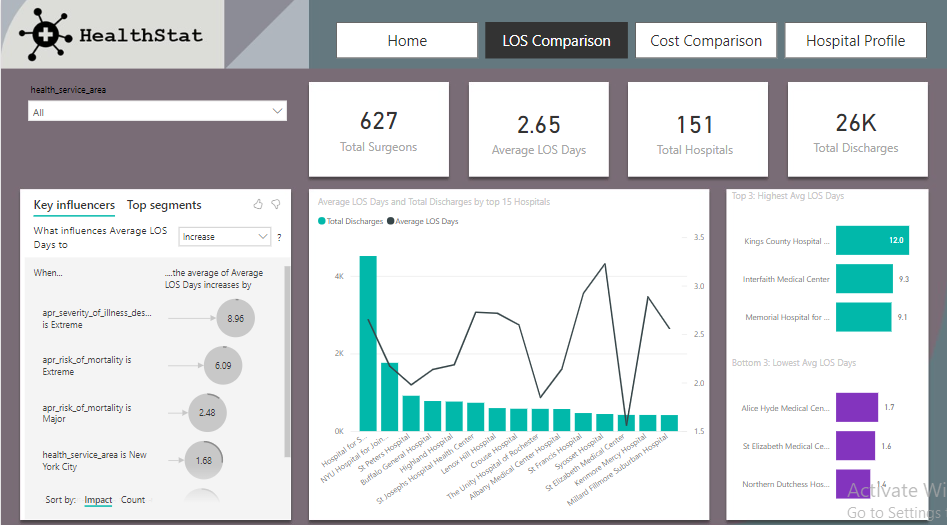
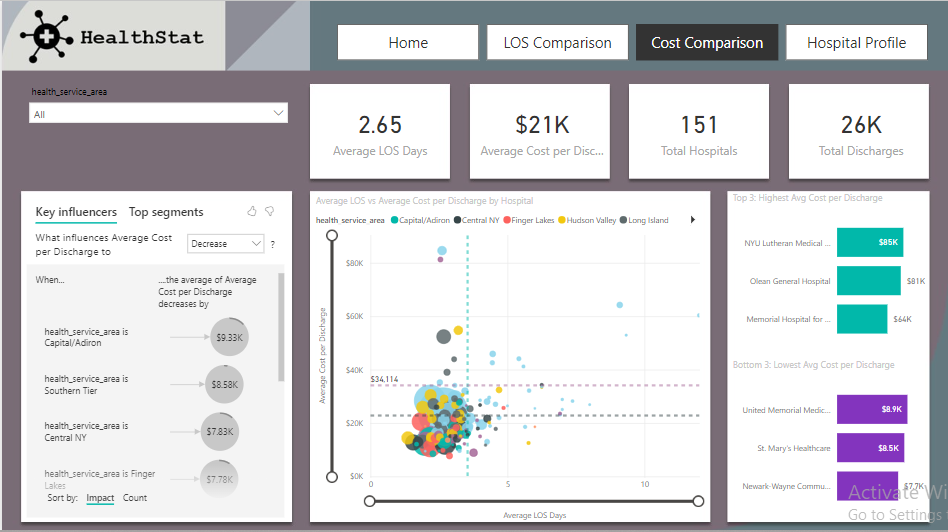
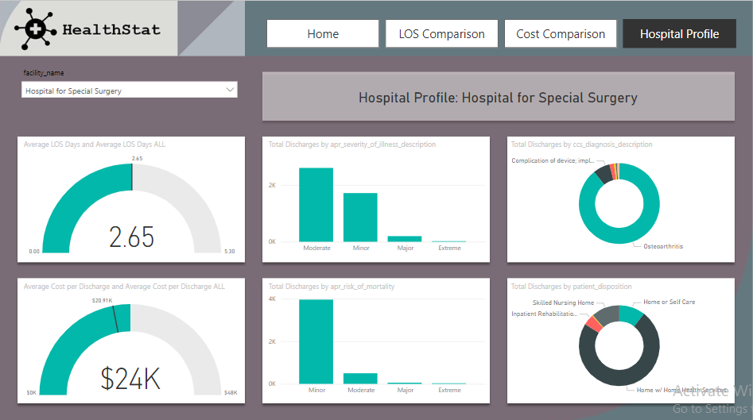

# Healthcare Analytics using PowerBI

HealthStat, a consulting company, hired us to analyze anonymized data from hospitals in New York state. The aim was to uncover insights on hospital efficiency for patients undergoing elective hip replacement surgery. Using Power BI, we created an engaging dashboard to visualize our findings.

## Dataset

- **Data Source**: New York state-wide hospital discharge data for the year 2016
- **Patient Population**: Those with "Elective hip replacement surgery"
- **Key Attributes of Interest**:
  - `length_of_stay`: Length of stay for patients.
  - `total_costs`: Total costs associated with each inpatient stay.

## Key Insights Categorized

- 151 hospitals in New York State performed the surgical procedure of interest.
- Over 26,000 discharges were recorded for the procedure.
- The average length of stay (LOS) for the procedure was 2.65 days, with significant variability between hospitals.
- Demographic data such as age and gender were examined, but key factors behind the variability in LOS are not yet understood.

## Business Recommendations

- Focus on hospitals with the highest costs and LOS for targeted efficiency improvements.
- Investigate hospitals with extreme illness severity and mortality risk for potential intervention strategies.
- Explore patient disposition processes to skilled nursing homes to reduce LOS.
- Consider specific strategies for hospitals in New York City due to their higher costs and LOS.

## Data Analysis

- **Number of Hospitals**: 151
- **Total Discharges**: 26,286
- **Average Length of Stay (LOS)**: 2.65 days

## Dashboard

The dashboard was designed to be interactive and user-friendly. It includes the following key elements:
- LOS Comparison
 

- Cost Comparison

- Hospital Profile

## DAX Calculations

- **Total Discharges**: `Total Discharges = COUNTROWS(hospital_discharges)`

- **Total Hospitals**: `Total Hospitals = DISTINCTCOUNT(hospital_discharges[facility_id])`

- **Average Cost per Discharge**: `Average Cost Per Discharge = DIVIDE(SUM(hospital_discharges[total_costs]),[Total Discharges])`

- **Average LOS Days**: `Average LOS Days = AVERAGE(hospital_discharges[length_of_stay])`

- **Percentage Variation in Avg Cost per Discharge**: `Percentage Variation in Average Cost per Discharge = DIVIDE(([Average Cost Per Discharge] - [Average Cost per Discharge ALL]), [Average Cost per Discharge ALL])`

- **Percentage Variation Average LOS Days**: `Percentage Variation Average LOS Days = DIVIDE(([Average LOS Days]-[Average LOS Days ALL]),[Average LOS Days ALL])`

## Conclusion
The New York state-wide hospital discharge data for elective hip replacement surgeries in 2016 was analysed and the Power BI dashboard provides actionable insights to HealthStat, enabling to identify hospitals with potential efficiency improvements and make informed decisions.
 
